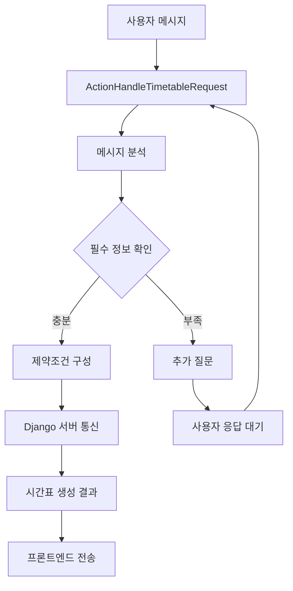
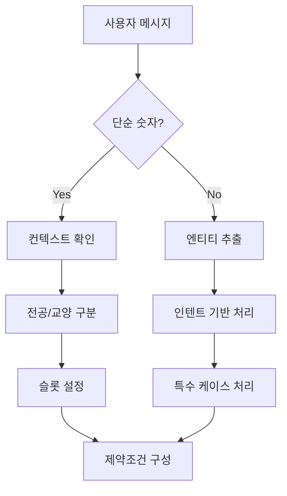

# Rasa Actions.py 완전 가이드 📚

## 📋 목차
1. [개요](#개요)
2. [전체 구조](#전체-구조)
3. [헬퍼 함수들](#헬퍼-함수들)
4. [액션 클래스들](#액션-클래스들)
5. [데이터 플로우](#데이터-플로우)
6. [주요 로직 분석](#주요-로직-분석)
7. [예시 시나리오](#예시-시나리오)
8. [트러블슈팅](#트러블슈팅)

---

## 🎯 개요

`actions.py`는 Rasa 챗봇의 핵심 비즈니스 로직을 담당하는 파일입니다. 사용자의 자연어 입력을 분석하여 시간표 생성에 필요한 제약조건을 추출하고, Django 서버와 통신하여 실제 시간표를 생성하는 역할을 합니다.

### 주요 기능
- 🎓 **학점 정보 추출**: 전공/교양 학점 파싱
- 📅 **공강일 정보 추출**: 요일별 공강 희망사항 파싱
- ⏰ **시간대 정보 추출**: 특정 시간/시간대 공강 파싱
- 📚 **과목 정보 추출**: 필수과목, 제외과목 파싱
- 💬 **Django 서버 통신**: 시간표 생성 API 호출
- 🔄 **상태 관리**: 대화 상태 및 슬롯 관리

---

## 🏗️ 전체 구조

```
actions.py
├── 📦 Import 및 설정
├── 🛠️ 헬퍼 함수들
│   ├── get_korean_day_abbr()
│   ├── extract_number()
│   ├── parse_time_range()
│   ├── parse_specific_time()
│   └── parse_day_time_combinations()
└── 🎭 액션 클래스들
    ├── ActionHandleTimetableRequest
    ├── ActionSaveTimetable
    └── ActionExcludeCourseAndRegenerate
```

### 주요 상수
```python
# Django 서버 통신 URL
DJANGO_PARSE_CONSTRAINTS_URL = "http://localhost:8000/parse_constraints/"
DJANGO_GENERATE_TIMETABLE_URL = "http://localhost:8000/generate_timetable_stream/"
```

---

## 🛠️ 헬퍼 함수들

### 1. `get_korean_day_abbr(day_text: Text) -> Text`
**목적**: 한글 요일 이름을 약자로 변환

```python
# 입력 예시
"월요일" → "월"
"화공강" → "화"
"수요일" → "수"

# 매핑 테이블
{
    "월요일": "월", "화요일": "화", "수요일": "수", 
    "목요일": "목", "금요일": "금",
    "월": "월", "화": "화", "수": "수", "목": "목", "금": "금",
    "월공강": "월", "화공강": "화", "수공강": "수", 
    "목공강": "목", "금공강": "금"
}
```

### 2. `extract_number(text: str) -> Optional[int]`
**목적**: 문자열에서 첫 번째 숫자 추출

```python
# 예시
"15학점" → 15
"전공 12학점" → 12
"abc123def456" → 123
"숫자없음" → None
```

### 3. `parse_time_range(time_text: str) -> Dict[str, Any]`
**목적**: 시간대 텍스트를 시간 범위로 변환

```python
# 변환 규칙
"오전" → {"start_hour": 9, "end_hour": 12}
"오후" → {"start_hour": 12, "end_hour": 18}
```

### 4. `parse_specific_time(time_text: str) -> Optional[int]`
**목적**: 특정 시간 텍스트를 24시간 형식으로 변환

```python
# 변환 규칙
"1교시" → 9시    # 1교시 = 9시
"2교시" → 10시   # 2교시 = 10시
"9시" → 9시      # 9-23시는 그대로
"1시" → 13시     # 1-8시는 오후로 간주 (13-20시)
"10시" → 10시
```

### 5. `parse_day_time_combinations(message: str) -> List[Dict[str, Any]]`
**목적**: 메시지에서 요일+시간 조합을 추출하는 가장 복잡한 함수

#### 처리 패턴 (우선순위 순)
1. **요일 + 오전/오후**: "월요일 오전", "화 오후"
2. **요일 + 구체적 시간**: "월요일 10시", "화 1시"
3. **요일 + 교시**: "월요일 1교시", "화 2교시"
4. **역순 패턴**: "오전 월요일", "10시 화요일"

#### 반환 형태
```python
# 시간 범위 (오전/오후)
{
    'day': '월',
    'type': 'time_range',
    'start_hour': 9,
    'end_hour': 12
}

# 특정 시간
{
    'day': '월',
    'type': 'specific_time',
    'hour': 10
}
```

---

## 🎭 액션 클래스들

### 1. ActionHandleTimetableRequest
**가장 중요한 메인 액션 클래스**

#### 핵심 역할
- 사용자의 시간표 요청을 종합적으로 처리
- 필수 정보(전공/교양 학점) 확인
- 부족한 정보가 있으면 추가 질문
- 모든 정보가 갖춰지면 시간표 생성 진행

#### 주요 메서드

##### `run()` - 메인 실행 로직
```python
def run(self, dispatcher, tracker, domain):
    # 1. 사용자 메시지 추출
    latest_user_message = tracker.latest_message.get('text')
    
    # 2. 제약조건 추출
    extracted_info, events = self.extract_constraints_from_rasa(tracker)
    
    # 3. 필수 정보 확인
    missing_slots = self.check_missing_required_slots(extracted_info)
    
    # 4. 조건별 처리
    if "major_credits" not in missing_slots and "elective_credits" not in missing_slots:
        # 시간표 생성 진행
    elif "major_credits" not in missing_slots and "elective_credits" in missing_slots:
        # 교양 학점 질문
    elif "major_credits" in missing_slots:
        # 전공 학점 질문
```

##### `extract_constraints_from_rasa()` - 제약조건 추출
**가장 복잡하고 중요한 메서드**

###### 처리 단계
1. **단순 숫자 입력 감지**: "15", "12학점"
2. **컨텍스트 파악**: 이전 봇 메시지로 전공/교양 구분
3. **슬롯 정보 처리**: 기존 저장된 정보 활용
4. **엔티티 기반 추출**: Rasa NLU 결과 활용
5. **인텐트 기반 추출**: 의도별 추가 처리
6. **특수 케이스 처리**: 복합 요청, 공강 조합 등

###### 컨텍스트 인식 로직
```python
# 이전 봇 메시지 확인
for event in reversed(list(tracker.events)):
    if event.get('event') == 'bot' and event.get('text'):
        last_bot_text = event.get('text', '')
        
        # 교양 학점 질문 후 숫자 응답
        if "교양" in last_bot_text and "학점" in last_bot_text:
            constraints["elective_credits"] = num_value
            
        # 전공 학점 질문 후 숫자 응답
        elif "전공" in last_bot_text and "학점" in last_bot_text:
            constraints["major_credits"] = num_value
```

###### 스마트 필터링 로직
```python
# 전공 슬롯 처리 시 교양 컨텍스트 고려
if major_credits_text:
    major_value = extract_number(major_credits_text)
    if major_value and constraints["major_credits"] is None:
        # 교양 학점 컨텍스트에서만 전공 슬롯 무시
        if number_processed and context_type == "elective" and major_value == extract_number(latest_message):
            logger.info("교양 학점 컨텍스트에서 전공 슬롯 값 무시")
        else:
            constraints["major_credits"] = major_value
```

### 2. ActionSaveTimetable
**시간표 저장 액션**

#### 역할
- 현재 생성된 시간표를 데이터베이스에 저장
- 프론트엔드에 저장 완료 이벤트 전송

```python
def run(self, dispatcher, tracker, domain):
    save_payload = {
        "event_type": "save_timetable",
        "message": "시간표를 저장합니다."
    }
    
    dispatcher.utter_message(text="시간표를 저장했습니다!")
    dispatcher.utter_message(json_message=save_payload)
```

### 3. ActionExcludeCourseAndRegenerate
**과목 제외 및 재생성 액션**

#### 역할
- 특정 과목을 제외하고 시간표 재생성
- 기존 제약조건 유지하면서 새로운 과목으로 교체

#### 과목명 추출 로직
```python
# 1. 엔티티에서 과목명 추출
for entity in entities:
    if entity["entity"] == "course_name_entity":
        exclude_courses.append(entity["value"].strip())

# 2. 정규표현식으로 과목명 추출
course_patterns = [
    r'(기초일본어|직업과 사회진출|ACTION ENGLISH|이산수학|캡스톤 디자인)(?:을|를|과목을|과목를)?',
    r'([가-힣]+(?:\s+[가-힣]+)*)(?:을|를|과목을|과목를)?\s*(?:빼고|제외하고|말고)',
]
```

#### 기존 제약조건 복원 로직
```python
# 최근 시간표 생성 이벤트에서 정보 추출
for event in reversed(list(tracker.events)):
    if event.get('event') == 'bot' and event.get('text'):
        bot_text = event.get('text', '')
        
        if ("시간표를 생성합니다" in bot_text or 
            "시간표가 생성" in bot_text):
            # 이 메시지에서 학점 정보 추출
            major_match = re.search(r'전공\s*(\d+)\s*학점', bot_text)
            elective_match = re.search(r'교양\s*(\d+)\s*학점', bot_text)
```

---

## 📊 데이터 플로우

### 1. 시간표 생성 플로우


### 2. 정보 추출 플로우


---

## 🔍 주요 로직 분석

### 1. 컨텍스트 인식 시스템
**문제**: "15"라는 숫자가 전공 학점인지 교양 학점인지 구분
**해결**: 이전 봇 메시지 분석으로 컨텍스트 파악

```python
# 이전 봇 메시지에서 키워드 확인
if "교양" in last_bot_text and "학점" in last_bot_text and "들으실" in last_bot_text:
    # 교양 학점 질문 후 숫자 응답
    constraints["elective_credits"] = num_value
    context_type = "elective"
```

### 2. 스마트 슬롯 필터링
**문제**: 잘못된 컨텍스트에서 슬롯 값이 적용되는 경우
**해결**: 컨텍스트 타입을 고려한 선택적 슬롯 적용

```python
# 교양 학점 컨텍스트에서만 전공 슬롯 무시
if number_processed and context_type == "elective" and major_value == extract_number(latest_message):
    logger.info("교양 학점 컨텍스트에서 전공 슬롯 값 무시")
else:
    constraints["major_credits"] = major_value
```

### 3. 우선순위 기반 패턴 매칭
**문제**: 다양한 요일+시간 조합 형태 처리
**해결**: 우선순위 순서로 정확한 패턴부터 매칭

```python
exact_patterns = [
    # 1순위: 정확한 요일+시간 조합
    r'(월요일|화요일|수요일|목요일|금요일|월|화|수|목|금)\s+(오전|오후)',
    # 2순위: 요일+구체적 시간
    r'(월요일|화요일|수요일|목요일|금요일|월|화|수|목|금)\s+(\d+)시',
    # 3순위: 역순 패턴
    r'(오전|오후)\s+(월요일|화요일|수요일|목요일|금요일|월|화|수|목|금)',
]
```

### 4. 중복 매칭 방지
**문제**: 같은 텍스트 영역이 여러 패턴에 매칭되는 경우
**해결**: 처리된 위치 추적으로 중복 방지

```python
# 이미 처리된 위치를 추적
processed_positions = set()

for match in re.finditer(pattern, message):
    start_pos, end_pos = match.span()
    
    # 겹치는 위치 확인
    if any(start_pos < p_end and end_pos > p_start for p_start, p_end in processed_positions):
        continue
        
    # 처리 후 위치 기록
    processed_positions.add((start_pos, end_pos))
```

---

## 📝 예시 시나리오

### 시나리오 1: 기본 시간표 생성
```
사용자: "전공 12학점, 교양 6학점으로 시간표 만들어줘"

처리 과정:
1. ActionHandleTimetableRequest 실행
2. 메시지에서 "전공 12학점", "교양 6학점" 추출
3. 필수 정보 확인 → 모두 있음
4. 시간표 생성 진행

결과:
- major_credits: 12
- elective_credits: 6
- 시간표 생성 API 호출
```

### 시나리오 2: 단계별 정보 수집
```
사용자: "시간표 만들어줘"
봇: "전공은 몇 학점 정도 들으실 계획인가요?"

사용자: "15"
처리: 컨텍스트 확인 → 전공 학점 질문 후 응답 → major_credits: 15

봇: "교양은 몇 학점 정도 들으실 계획인가요?"

사용자: "3"
처리: 컨텍스트 확인 → 교양 학점 질문 후 응답 → elective_credits: 3

봇: "전공 15학점, 교양 3학점 조건으로 시간표를 생성합니다."
```

### 시나리오 3: 복합 조건 처리
```
사용자: "전공 9학점, 교양 3학점, 월요일 오전 공강으로 시간표 만들어줘"

처리 과정:
1. 전공/교양 학점 추출: major_credits: 9, elective_credits: 3
2. 요일+시간 조합 분석: "월요일 오전" → 월요일 9-12시 공강
3. 모든 조건 만족하여 시간표 생성 진행

결과:
- major_credits: 9
- elective_credits: 3
- specific_avoid_time_ranges: [{"day": "월", "start_hour": 9, "end_hour": 12}]
```

### 시나리오 4: 과목 제외 요청
```
사용자: "기초일본어 빼고 다른 과목으로 바꿔줘"

처리 과정:
1. ActionExcludeCourseAndRegenerate 실행
2. 과목명 추출: "기초일본어"
3. 최근 시간표 생성 이벤트에서 기존 제약조건 복원
4. 제외 과목 설정하여 재생성

결과:
- exclude_courses: ["기초일본어"]
- 기존 제약조건 유지
- 시간표 재생성
```

---

## 🚨 트러블슈팅

### 자주 발생하는 문제들

#### 1. 컨텍스트 인식 실패
**증상**: 교양 학점 질문 후 전공 학점으로 잘못 인식
**원인**: 봇 메시지 패턴 매칭 실패
**해결**: 로그 확인 후 패턴 정확성 검증

```python
# 디버깅 로그 추가
logger.debug(f"최근 봇 메시지: '{last_bot_text}'")
logger.debug(f"컨텍스트 타입: {context_type}")
```

#### 2. 슬롯 값 중복 설정
**증상**: 같은 값이 전공/교양 둘 다에 설정됨
**원인**: 스마트 필터링 로직 오류
**해결**: 컨텍스트 타입별 필터링 강화

#### 3. 요일+시간 조합 누락
**증상**: "월요일 오전 공강"이 인식되지 않음
**원인**: 정규표현식 패턴 불일치
**해결**: 패턴 우선순위 재조정

#### 4. 과목명 추출 실패
**증상**: 제외하고 싶은 과목이 인식되지 않음
**원인**: 과목명 패턴 부족
**해결**: 패턴 추가 및 조사 처리 강화

### 디버깅 팁

#### 1. 로그 레벨 조정
```python
# 상세 로그 확인
logging.basicConfig(level=logging.DEBUG)
```

#### 2. 슬롯 상태 확인
```python
# 현재 슬롯 상태 출력
logger.debug(f"슬롯 상태 - 전공: {tracker.get_slot('major_credits_slot')}")
logger.debug(f"슬롯 상태 - 교양: {tracker.get_slot('elective_credits_slot')}")
```

#### 3. 엔티티 확인
```python
# 추출된 엔티티 확인
entities = tracker.latest_message.get('entities', [])
logger.debug(f"엔티티 목록: {entities}")
```

#### 4. 이벤트 히스토리 확인
```python
# 최근 이벤트 확인
for event in reversed(list(tracker.events)[-10:]):
    logger.debug(f"이벤트: {event}")
```

---

## 📚 학습 가이드

### 1. 초보자를 위한 학습 순서
1. **헬퍼 함수 이해** → 기본 유틸리티 함수들
2. **액션 구조 파악** → Rasa 액션 클래스 구조
3. **메인 로직 분석** → ActionHandleTimetableRequest
4. **고급 기능 학습** → 컨텍스트 인식, 패턴 매칭

### 2. 핵심 개념
- **슬롯 (Slot)**: 대화 상태 저장 공간
- **엔티티 (Entity)**: NLU로 추출된 정보
- **인텐트 (Intent)**: 사용자 의도
- **이벤트 (Event)**: 대화 이력 및 상태 변화

### 3. 실습 과제
1. 새로운 시간 패턴 추가하기
2. 과목 카테고리 필터링 기능 구현
3. 다중 공강일 처리 로직 개선
4. 에러 처리 및 fallback 로직 강화

---

## 🔧 확장 가능성

### 1. 추가 가능한 기능
- **학년별 필터링**: 1학년, 2학년 과목 구분
- **교수별 필터링**: 특정 교수 과목 선호/비선호
- **건물별 필터링**: 이동 거리 최소화
- **난이도별 필터링**: 쉬운/어려운 과목 조합

### 2. 성능 최적화
- **캐싱**: 자주 사용되는 패턴 결과 캐싱
- **병렬 처리**: 여러 패턴 동시 매칭
- **메모리 최적화**: 불필요한 객체 생성 방지

### 3. 확장성 고려사항
- **다국어 지원**: 영어 시간표 생성
- **API 버전 관리**: Django 서버 API 변경 대응
- **테스트 커버리지**: 단위 테스트 및 통합 테스트

---

**📝 마지막 업데이트**: 2024년 1월
**✍️ 작성자**: [팀명]
**🔗 관련 문서**: Django API 문서, Rasa 공식 문서

---

*이 문서는 actions.py 파일의 모든 기능을 상세히 설명하고 있습니다. 궁금한 점이 있으면 언제든지 팀원들과 상의하세요! 🚀* 